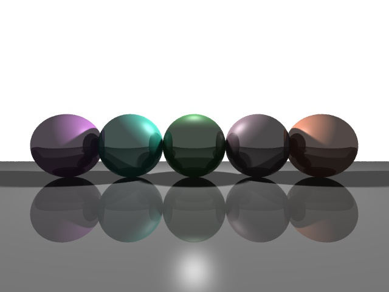
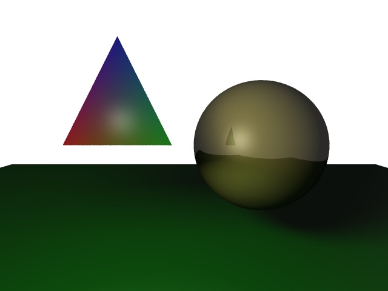
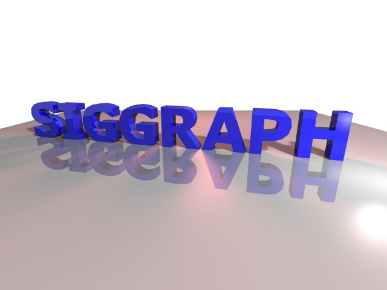
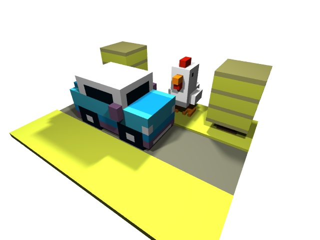
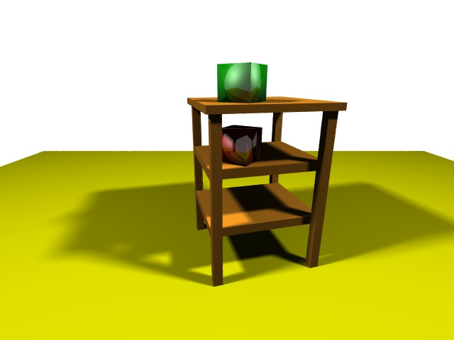
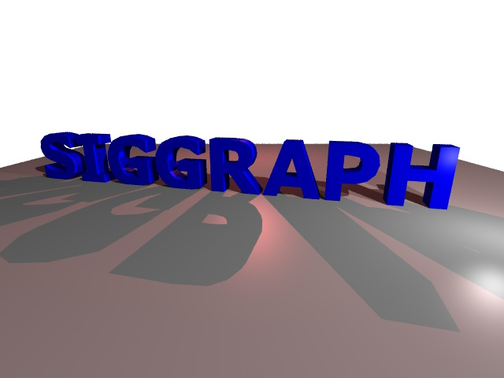
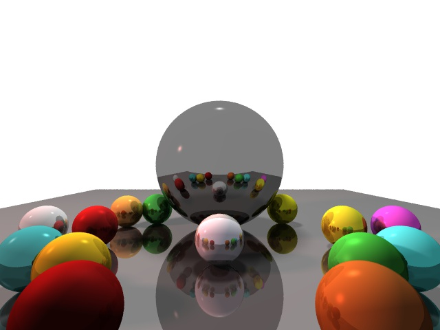
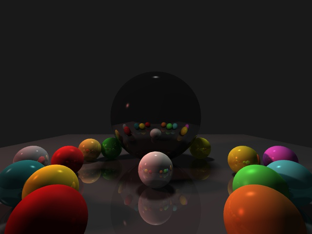
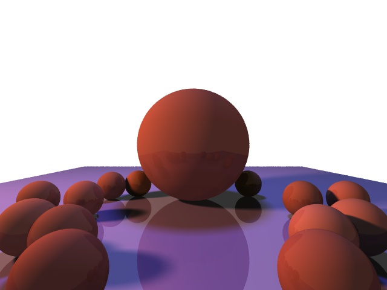

# Ray Tracer

### Usage

```bash
cd hw3
make
./hw3 <FILE_NAME>.scene <Optional Screenshot File>
```

## Features

### 1. Recursive Reflection

Allowed recursive reflection with:

- `I = lightColor * (kd * (L dot N) + ks * (R dot V) ^ sh)`
- `(1 - ks/rec_ref_coef) * localPhongColor + ks/rec_ref_coef * colorOfReflectedRay`

where `rec_ref_coef` controls the degree/extent of the recursive effect wanted. It and also `MAX_RECURSIVE_DEPTH` can be changed to vary recursive reflection effect. See implementation in `computeColor()`

### 2. Good Antialiasing

See `draw.scene()` for implementation. Adjust `samples_per_pixel` for super sampling vs efficiency. Samples drawn from uniform distribution for each sample. Effect of each sample normalized per pixel. Introduces smoothness and reduces jaggedness.

### 3. Soft Shadows

See `computeColor()` and `Light` struct for implementation. Modified `Light` Struct to have default area and `num_samples` per light source. 1x1 light source grid divided into further mini grids for drawing samples with offsets. These samples are mini light sources whose effect is normalized per area light source (i.e. per light source in scene file). Used the center of the area light source for intersection calculation. The proportion of unblocked shadow rays per light source determines the softness of the shadow.

### 4. Additional Features

- Included `vec3.h` helper class with overloaded operators to help with defining colors, points and directions
- Included extra scene files like `test3`, `test4` etc. See images 007.jpg onwards

## Controls

- **Exit screen:** ESC

## Sample Images

Here are some sample images generated by the ray tracer:

<table>
<tr>
<td></td>
<td></td>
</tr>
<tr>
<td></td>
<td></td>
</tr>
<tr>
<td></td>
<td></td>
</tr>
<tr>
<td></td>
<td></td>
</tr>
<tr>
<td></td>
<td></td>
</tr>
</table>

## Implementation Notes

- Used [Möller–Trumbore intersection algorithm](https://en.wikipedia.org/wiki/M%C3%B6ller%E2%80%93Trumbore_intersection_algorithm) as reference for triangle ray intersection i.e. `hitTriangle()` method in code
- Change `focal_length` to change camera focal length
- Change `background_color` if needed
